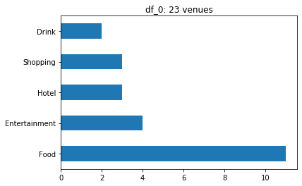

======
Report
======

----------------------------------------------
Capstone Project - The Battle of Neighborhoods
----------------------------------------------

Introduction
============

This project is in fulfilment of the Applied Data Science Capstone [adsc]_ module offered by IBM
and hosted on Cousera.
The task is to think of an idea that leverages Foursquare [fsq]_ location data to explore or
compare neighborhoods or cities.
In this capstone project, we consider how someone can analyze the existing venues in a seaside town in England
in order to decide on the best place in which to open a new Fish & Chips shop.

Business Problem
================

There are **10,500** Fish & Chips shops in the UK, with an annual spend of **£1.2 billion** on fish and chips [nfff]_.
Bournemouth [brnm]_ was ranked as the number one most popular seaside resort of 2019
in the UK [indy]_.
Therefore, we want to open our new Fish & Chips shop in Bournemouth to capitalise on its popularity with a food shop
that is likely to be popular with the locals.

There are some considerations that we need to make when choosing where to open our new shop.
We want it to be in an area of the town where people would want to eat this kind of food.
That is, in an area that has lots of activities, such as drinking, shopping, and entertainment venues.
Preferably, such an area wouldn't already have many food venues, so that competition is as low as possible.

Data
====

To solve this task, we need to understand what venues are already in Bournemouth, so that we can analyse them and
decide on the best area in which to open our own shop.
We will use the venue recommendation API [expl]_ by Foursquare to gain insight into the recommended
venues in Bournemouth.
We will then categorize these venues into six high-level groups:
`Drink`, `Entertainment`, `Food`, `Hotel`, `Shopping`, and `Transport`.

We will use these groups to understand how venues are dispersed by business type.
Then, we will use DBSCAN, a data clustering algorithm, to cluster venues based on their relative distance
from each other.
This information will help us to determine where to open up our own Fish & Chips shop based upon existing venue
density and business type.

Methodology
===========

We downloaded venue recommendation information from Foursquare using its API.
Our specification was as follows:

- We used the Foursquare API version no later than `June 30 2019`.
- We used a latitude of `50.721680` and longitude of `-1.878530` to point to Bournemouth.
- We wanted venues up to `1.5km` around Bournemouth.
- We limited our results to `100` venues.

This returned `100` venues in Bournemouth that we turned into a data frame `df_venues`.
The first five rows of `df_venues` were as follows.

+---------------------+--------------------+----------------+-----------------+
| Venue Name          | Venue Category     | Venue Latitude | Venue Longitude |
+=====================+====================+================+=================+
| South Coast Roast   | Coffee Shop        | 50.720913      | -1.879085       |
+---------------------+--------------------+----------------+-----------------+
| DelMarco            | Italian Restaurant | 50.721370      | -1.877221       |
+---------------------+--------------------+----------------+-----------------+
| Lower Gardens       | Park               | 50.719323      | -1.878195       |
+---------------------+--------------------+----------------+-----------------+
| Bournemouth Gardens | Park               | 50.718990      | -1.877733       |
+---------------------+--------------------+----------------+-----------------+
| Bournemouth Square  | Plaza              | 50.720156      | -1.879563       |
+---------------------+--------------------+----------------+-----------------+

Venue Groups
------------

There were `51` unique venue categories in our data frame, which included:
- Aquarium
- Chinese Restaurant
- Nightclub
- Scenic Lookout
- Theater
- Train Station

Such an exhaustive list of categories was difficult to work with.
Also, many of the categories were very similar e.g. Caribbean Restaurant, Tapas Restaurant, and Turkish Restaurant.
We added another column to our data frame, `Venue Group`, that grouped all `51` categories into the following six
groups: `Drink`, `Entertainment`, `Food`, `Hotel`, `Shopping`, and `Transport`.
We show how the venues look on a map of Bournemouth when color coded by `Venue Group` in the figure below.

.. figure:: ../data/vis_group.png
    :alt: Visualization: venue group.

    Venues, color-coded by group.

`Entertainment` (pink) venus are closer to the beach, and most `Food` (red) and `Drink` (black) venues cluster in the
center of town, along with all of the `Shopping` (dark blue) venues. `Hotels` (peach) are dispersed across town,
and `Transport` (brown) is the furthest out of town, in the top-right of the map.

Density-Based Clustering
------------------------

Now, we wanted to consider the proximity of venues, so that we are able to identify the most populated clusters of
venues.
This is so that our Fish & Chips shop is in a location that is likely to have a lot of potential customers that are
visiting other venues in town.

For this task, we used the scikit-learn implementation of the DBSCAN data clustering algorithm [dbscan]_
which clusters based upon the density of data points and can also detect outliers.
We set `eps`, the maximum distance between two samples, to `0.2`.
We set `min_samples`, the number of samples in a neighborhood for a point to be considered as a core point, to `3`.

The resulting clusters we added to our data frame in a column called `Venue Cluster`,
and the venues are visualized by cluster in shown the figure below.

    Venues, color-coded by cluster.

We see that, outside of the outlier class `-1`, the two most densely populated clusters are `0` (teal) and `2` (green),
which are both in the center of town.
We visualize this with the histogram below.

    Frequency of venue clusters.

Results
=======

We have identified the two largest venue clusters in Bournemouth:
cluster `0`, which has `23` venues in it; and
cluster `2`, which has `27` venues in it.
We moved these into their own data frames `df_0` and `df_2`, respectively.
Now, we wanted to analyse the venue distribution within each cluster, to help us reason about which cluster we should
open our own Fish & Chips shop in.

    A bar chart showing the venues in cluster 0.

    A bar chart showing the venues in cluster 2.

We see that, of the two clusters, cluster `0` has fewer `Food` venues, which is desirable.
However, it is only marginally lower than the `Food` venues in `2`.
Furthermore, cluster `2` has a more non-`Food` venues than `0`, which is desirable.
Areas with many places to `Drink` are a hotspot for Fish & Chips food after a night of drinking, and people who
do `Shopping` in the day time might like to eat Fish & Chips for lunch or dinner.

Discussion
==========

Given the analysis in the Results section, we would want to open our Fish & Chips shop in cluster `2`.
This is because it is densely popular with venues that are not `Food` related, despite having slightly more
`Food` venues than cluster `0`.

All other clusters in the Bournemouth area are too small to consider opening a Fish & Chips store, and many of the
venues were considered to be outliers by our DBSCAN implementation because they were scattered across the town.
These would have been suboptimal locations, because fewer customers would have been in these areas.

Conclusion
==========

In our report, we decided to open a Fish & Chips store in the Bournemouth area.
We used the Foursquare API to find the recommended venues in this town.
These venues were placed into six high-level groups and clustered using the DBSCAN algorithm.
We found a cluster which was densely packed with venues and, while it did not have the lowest number of food
venues than another potential cluster, it had more non-food venues, which made it the most desirable place in
Bournemouth to open up our Fish & Chips shop.

References
==========

.. [adsc] https://www.coursera.org/learn/applied-data-science-capstone
.. [brnm] https://www.bournemouth.co.uk
.. [dbscan] https://scikit-learn.org/stable/modules/generated/sklearn.cluster.DBSCAN.html
.. [expl] https://developer.foursquare.com/docs/api/venues/explore
.. [fsq] https://foursquare.com
.. [indy] https://www.independent.co.uk/travel/news-and-advice/uk-seaside-towns-beach-best-heatwave-summer-staycation-british-a8978111.html
.. [nfff] https://www.nfff.co.uk/pages/fish-and-chips
